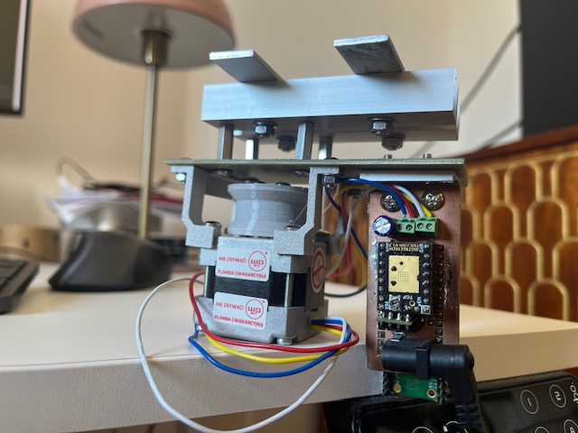

# Curtain Firmware

Firmware for a small DIY device that opens the curtains in my bedroom at a
scheduled time each morning. It runs on a **Raspberry Pi Pico W** and drives a
stepper motor through a **TMC2209** silent stepper driver.

This is a personal hobby project, shared in case the approach is useful to anyone
building something similar — in particular the **sensorless obstacle detection** and
the hand-rolled **TMC2209 UART driver**.

## What it does

At a configured time of day the device wakes up, drives the stepper motor to pull the
curtains open, and stops. It only ever **opens** the curtains — closing them is not
part of the device's job. There are no limit switches and no end-stop sensors. Instead:

- The motor is driven at a **deliberately low current** (low torque) using the
  TMC2209's StealthChop mode.
- When the curtain reaches the end of its travel — or hits any obstacle — the low
  torque is not enough to keep turning, so the motor **stalls**.
- The stall is detected **sensorlessly** using the TMC2209's **StallGuard4** feature,
  which raises the driver's `DIAG` pin. The firmware sees that and stops driving.

So the same mechanism that makes the device gentle (it won't force through an
obstruction) is also what tells it when the curtain is fully open.

Time of day comes from the network: on boot the Pico W connects to Wi‑Fi and syncs the
clock over **NTP**, then uses the RP2040's real-time clock alarm to fire at the
configured hour and minute.

## How it works

The firmware has two modes, selected at boot:

1. **Config mode** (normal power-on) — the device brings up a Wi‑Fi access point and
   serves a small web page where you enter your Wi‑Fi credentials and the open time.
   The settings are written to on-board flash.
2. **Run mode** (entered via a watchdog reboot after config is saved) — the device
   connects to your Wi‑Fi, syncs time over NTP, sets the RTC alarm, and then sleeps
   until the alarm fires. When it fires, it energizes the motor and drives until either
   a stall is detected on `DIAG` or a safety timeout elapses.

### The TMC2209 driver

The driver is talked to over its **single-wire UART** interface, implemented from
scratch in [`firmware/tmc2209.cpp`](firmware/tmc2209.cpp) — datagram framing, CRC,
read/write with transmit-counter verification, and typed register access. It configures
StealthChop, the current levels (`IRUN`/`IHOLD`), and the StallGuard threshold
(`SGTHRS`).

StealthChop needs a one-time **automatic tuning** (calibration) pass at power-up before
stall detection is reliable. The current tuning procedure, how it maps to the
datasheet, and a plan to store the calibration in flash (so the tuning move isn't
repeated on every boot) are documented in
[`docs/stealthchop-calibration.md`](docs/stealthchop-calibration.md).

## Hardware

- **Raspberry Pi Pico W** (RP2040 + Wi‑Fi)
- **TMC2209** stepper driver
- A stepper motor coupled to the curtain mechanism

Pin assignments are in [`firmware/wiring.h`](firmware/wiring.h):

| Signal | Pico W GPIO |
|--------|-------------|
| `STEP`  | GP3 |
| `ENN` (enable, active low) | GP6 |
| `DIAG` (stall output) | GP7 |

The TMC2209 UART pins and motor current reference (`VREF`) are set on the driver board;
`VREF` is where the low-torque current level is dialed in.

## Building and flashing

See [`BUILDING.md`](BUILDING.md). In short: a Docker image with the Pico SDK and ARM
toolchain builds `blink.uf2`, which you drag-and-drop onto the Pico W in BOOTSEL mode
(or flash via `picotool` / OpenOCD + picoprobe).

## Repository layout

- `firmware/` — the firmware source (Pico SDK, CMake project)
  - `tmc2209.cpp` / `tmc2209.h` — the TMC2209 UART driver
  - `blink.cpp` — top-level boot logic, scheduling, and the run loop
  - `Server.cpp` / `fs/` — the Wi‑Fi config web page
  - `picow_ntp_client.*`, `dhcp.*` — networking helpers
  - `Persistence.*`, `Config.h` — flash-stored settings
  - `wiring.h` — GPIO pin assignments
- `docs/` — design notes (TMC2209 StealthChop calibration)
- `BUILDING.md` — build, toolchain, and flashing instructions
- `tmc2209_datasheet_rev1.09.pdf`, `RP-*.pdf` — reference datasheets

## Status

Working personal project, still evolving. The calibration-persistence work described in
the docs is the main open item. Not intended as a polished, general-purpose product —
expect rough edges.

## Device - as assembled

